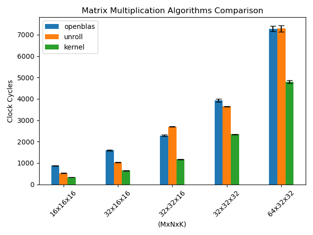
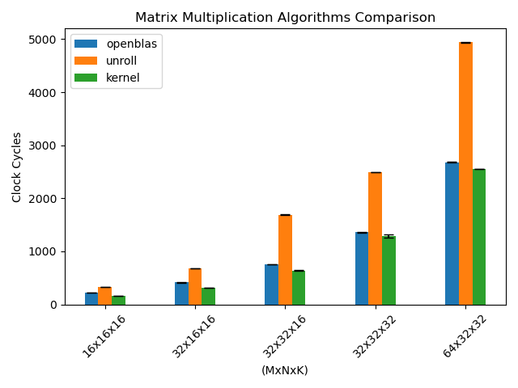

# Small-GEMM

Optimized small-matrix GEMM library with AVX2 & AVX-512 support.

## Build

```bash
cmake -B build -S . -DCMAKE_BUILD_TYPE=Release -DBUILD_TYPE=[STATIC|SHARED|EXECUTABLE]
cmake --build build
```

## Performance

Compared two fastest algorithms against [OpenBLAS](https://github.com/OpenMathLib/OpenBLAS):

<p float="left">
  <figure style="display:inline-block; text-align:center; margin-right:2%">
    
    <figcaption>Test on AVX-2 CPU: AMD Ryzen 5 5600H</figcaption>
  </figure>
  <figure style="display:inline-block; text-align:center;">
    
    <figcaption>Test on AVX-512 CPU: Intel Core i5-11400F</figcaption>
  </figure>
</p>

## Test

Build the executable and run the test script:
```
cmake -B build -S . -DCMAKE_BUILD_TYPE=Release -DBUILD_TYPE=EXECUTABLE
cmake --build build
python test.py
```
Configure tests via tests.txt (it contains matrix sizes & iteration counts).
